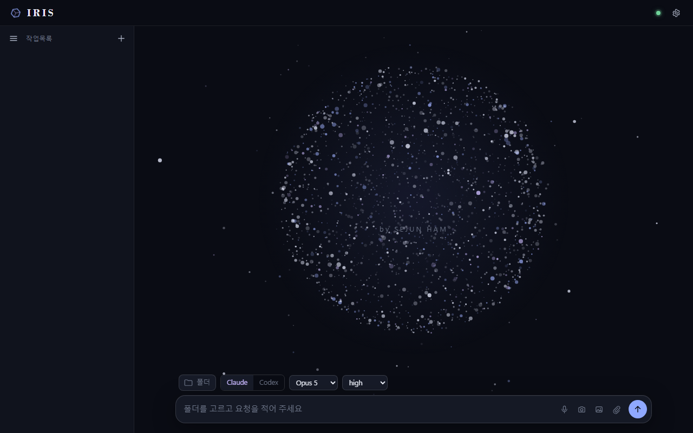

# IRIS-Face

**English: [README.md](README.md)**

윈도우에서 **클로드코드(Claude Code)·코덱스(Codex)** 세션 여러 개를 한 창에 모아 지휘하는 데스크톱 앱. 폴더를 고르고, 터미널에서 하듯 에이전트·모델·사고깊이를 직접 고른 뒤 요청하면, IRIS-Face 가 **기존 CLI를 그대로** 숨은 가상 터미널로 띄우고 세션 기록파일을 읽어 깔끔한 대화 화면으로 그립니다. 미리보기·보조 작업 칩·완료 알림이 붙습니다.

CLI 설정·구독·지시 파일은 절대 건드리지 않습니다. 폴더를 지우면 끝입니다.



## 어떻게 돌아가나

```text
① 고르기   — 폴더 · Claude/Codex · 모델 · 사고깊이 · (권한 모드)   → Enter
      ↓
② 띄우기   — 데몬이 그 폴더에서 진짜 CLI를 ConPTY(node-pty + xterm headless) 안에 실행
      ↓
③ 그리기   — CLI 가 스스로 쓰는 기록파일(.jsonl)을 꼬리 읽기해 차례(요청 → 과정 → 답)로 표시
      ↓
④ 잇기     — 같은 세션에 이어 말하거나, 모델·깊이를 바꿔 재개하거나, Claude↔Codex 로 넘기기(맥락 인계)
      ↓
⑤ 지키기   — 창을 닫아도 세션은 살아 있고, 트레이 ⏻ 로 한 번에 전부 종료
```

| 요소 | 정체 |
|---|---|
| `daemon/` | 순수 Node HTTP + WebSocket 서버(`127.0.0.1:3458`). 가상 터미널 소유, 기록 꼬리 읽기, 페이지 서빙. |
| `app/` | 화면(프레임워크 없는 JS/CSS). 별의 구 무대, 작업목록, 입력창, 설정, 미리보기. |
| `app/electron/` | Electron 창 + 트레이. 선택 사항: `node launch.mjs --browser` 면 브라우저로 엽니다. |
| `state/` | 런타임 상태(세션·로그·캐시·설정). git 제외. |
| `scripts/` | 회귀 검사(`npm run verify:*`). |

## 기능

- **세션 여러 개, 창 하나** — 왼쪽 작업목록(Ctrl+1…9 로 이동), 세션마다 폴더·에이전트·조합을 따로 기억.
- **터미널과 같은 선택** — 에이전트·모델·사고깊이·권한 모드는 **CLI 시작 플래그로만** 전달. `settings.json`·`config.toml` 무접촉.
- **대화 중 조합 바꾸기** — 같은 에이전트면 `--resume` / `codex resume`, 다른 에이전트면 최근 차례를 새 CLI 첫 요청으로 인계.
- **대화 안 미리보기** — 이미지·HTML·PDF·localhost 주소, (선택) 한/글·오피스 문서는 PDF 로 변환해 그 자리에. ⧉ 는 원본 열기.
- **보조 작업 칩** — 서브에이전트가 칩(상태·모델·도구 횟수·경과)으로 보이고, 누르면 읽기 전용 서랍에 그 기록.
- **완료 알림** — 요청이 끝나면 작은 토스트, 창이 뒤에 있으면 윈도 알림.
- **진짜 터미널** — Ctrl+T 로 어느 세션이든 원래 터미널 보기, Esc 로 중단.
- **음성 입력**(선택) — 🎤 / Ctrl+M 녹음 → 로컬 faster-whisper 가 전사 → 글이 커서 자리에. PC 밖으로 나가지 않음.
- **꾸미기** — 헤더 마크 21종·글자체·테마 9종·무대 애니메이션, 전부 ⚙ 설정에서.
- **서명** — Ctrl+Alt+I 로 별 속에 만든 사람의 서명.

## 필요한 것

| 필수 | 비고 |
|---|---|
| Windows 10/11 | node-pty 의 ConPTY. |
| Node.js ≥ 22 (24 에서 시험) | `npm install` 이 `node-pty` 빌드와 Electron 내려받기를 합니다. |
| 클로드코드 CLI 또는 코덱스 CLI | 설치·로그인된 것. IRIS-Face 는 PATH 에 있는 것을 띄우기만 합니다. |

선택(자동 감지 — 없으면 그 기능만 조용히 꺼짐):

| 기능 | 켜는 조건 |
|---|---|
| 🎤 음성 입력 | Python 3 + `pip install faster-whisper`(CUDA 있으면 사용). 파이썬이 PATH 에 없으면 `IRIS_FACE_PYTHON`. |
| 한/글·오피스 → PDF 미리보기 | `pywin32` 가 있는 파이썬(오피스), `pyhwpx` venv(한/글). `IRIS_FACE_PY`, `IRIS_FACE_HWP_PY`. |
| 사용량 배터리 + Ctrl+D 대시보드 | TeamClaude 대시보드 도구. `TEAMCLAUDE_DASH_DIR`, `TEAMCLAUDE_DASH_PORT`. 없으면 헤더 배터리와 서랍이 숨겨짐. |
| 폴더 선택기 트리 | IRIS 작업공간(`_ontology/graph.json`). 없으면 폴더 경로를 직접 적음. |

## 설치

```
git clone https://github.com/Feynman520/d06-p02-iris-face
cd d06-p02-iris-face
npm install
node launch.mjs            # 데몬이 없으면 띄우고 Electron 창을 엽니다
```

- `node launch.mjs --browser` — Electron 대신 기본 브라우저로.
- `node launch.mjs --no-open` — 데몬만(`http://127.0.0.1:3458/`).
- 전부 종료: 트레이 아이콘 → ⏻, 또는 ⚙ 설정 → 전부 종료. 창 닫기는 숨기기일 뿐이며 세션은 계속 돕니다.

## 환경변수

| 변수 | 기본값 | 용도 |
|---|---|---|
| `IRIS_FACE_PORT` | `3458` | 데몬 포트(시험용 둘째 데몬: `IRIS_FACE_PORT=3459 IRIS_FACE_STATE=<폴더>`). |
| `IRIS_FACE_STATE` | `./state` | 런타임 상태 폴더. |
| `IRIS_ROOT` | 자동(`_agent/` 또는 `_ontology/graph.json` 이 있는 가장 가까운 상위 폴더) | 헤더에 보이고 폴더 선택기가 쓰는 작업공간 루트. |
| `IRIS_FACE_PYTHON` | 자동(`%LOCALAPPDATA%\Programs\Python` → PATH) | 음성 입력용 파이썬. |
| `IRIS_FACE_PY` / `IRIS_FACE_HWP_PY` | `python` / 자동 | 오피스 / 한/글 문서 변환용 파이썬. |
| `TEAMCLAUDE_DASH_DIR` / `TEAMCLAUDE_DASH_PORT` | 자동 / `3457` | TeamClaude 대시보드 도구 위치와 뷰어 포트. |
| `CLAUDE_CONFIG_DIR` | `<루트>/_agent/claude` | 클로드코드 설정 위치(그대로 전달). |
| `IRIS_FACE_ENTER_QUIET_MS` / `IRIS_FACE_ENTER_MAX_WAIT_MS` | `300` / `3000` | CLI 입력창에 붙여넣은 뒤 Enter 를 치는 타이밍(`daemon/sessions.mjs` 참고). |

## 단축키

| 키 | 동작 |
|---|---|
| Enter / Ctrl+Enter | 보내기 / 줄바꿈 |
| ↑ ↓ | 입력 이력 |
| Ctrl+N · Ctrl+O | 새 세션 · 폴더 선택 |
| Ctrl+1…9 | 세션 이동 |
| Ctrl+T | 터미널 보기 |
| Ctrl+M | 음성 입력 |
| Ctrl+D | 사용량 대시보드(있을 때) |
| Ctrl+, | 설정 |
| Esc | 실행 중인 요청 중단 / 서랍 닫기 |

## 설계 메모

- **무접촉 원칙** — CLI·설정·지시 파일은 IRIS-Face 에게 읽기 전용. 세션 고유의 것은 전부 `state/` 에 두거나 시작 플래그로 넘깁니다.
- **CLI 로 들어가는 길은 하나** — 글은 `sessions.mjs send()` 로만: 붙여넣기 → 화면이 잠잠해질 때까지 대기 → Enter → 확인 → 재시도. `state/daemon.log` 에 `send` / `enter ok` / `enter retry` / `enter FAILED` 가 남습니다.
- **네이티브 대화상자 금지** — 윈도 Electron 창은 `alert()` 를 닫으면 키보드 초점을 잃기 때문에 페이지 안 `Dialog` 만 씁니다.
- 설계 문서: [docs/설계.md](docs/설계.md), [docs/디자인.md](docs/디자인.md).

## 삭제

⏻ 로 종료한 뒤 폴더를 지우면 됩니다. 다른 곳에는 아무것도 쓰지 않습니다.

## 허가서

MIT — © 2026 함세준(Sejun Ham). "해결은 에이전트가, 정의는 우리가."
